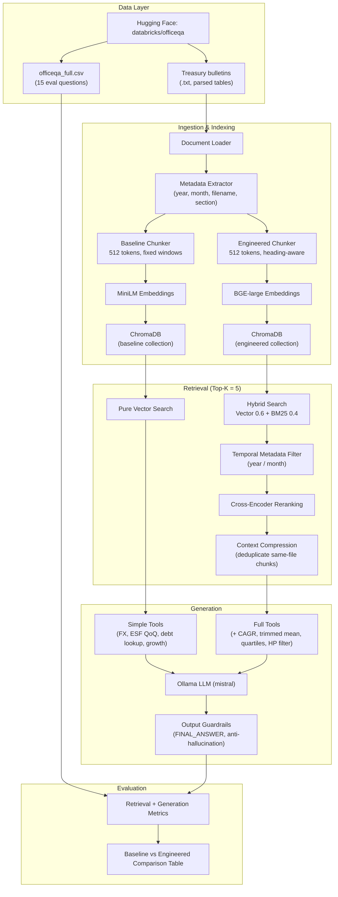

# Treasury Financial Question Answering RAG System

A **Retrieval-Augmented Generation (RAG)** system that answers computation-heavy financial questions using U.S. Treasury Bulletin reports from the [Databricks OfficeQA](https://huggingface.co/datasets/databricks/officeqa) dataset.

The project implements two end-to-end pipelines designed for fair, measurable comparison:

| Pipeline | Role |
|----------|------|
| **Baseline** | Minimal reference RAG — fixed chunking, MiniLM embeddings, pure vector search, **simple lookup tools only**, light guardrails |
| **Engineered** | Optimized RAG — heading-aware chunking, BGE embeddings, metadata filtering, hybrid search, reranking, **full tool suite**, strict guardrails |

Both pipelines share the same local LLM (Ollama `mistral`) and evaluation framework.

---

## Table of Contents

- [Architecture](#architecture)
- [Dataset & Downloading](#dataset--downloading)
- [Local Setup](#local-setup)
- [Usage](#usage)
- [Evaluation Metrics](#evaluation-metrics)
- [Results: Baseline vs Engineered](#results-baseline-vs-engineered)
- [Why the Engineered Pipeline Performs Better](#why-the-engineered-pipeline-performs-better)
- [Analysis & Design Insights](#analysis--design-insights)
- [Project Structure](#project-structure)
- [Configuration](#configuration)
- [External Tools](#external-tools)
- [License & Acknowledgments](#license--acknowledgments)

---

## Architecture

The system follows a classic RAG stack with a **tiered tool-augmented generation** layer. Baseline uses a limited tool set; engineered adds advanced statistics and stricter grounding.



### Pipeline stages in detail

#### 1. Data ingestion

- **Source:** Hugging Face dataset `databricks/officeqa` (gated — requires account approval).
- **Reports:** Parsed Treasury bulletin text files under `treasury_bulletins_parsed/transformed/` (e.g. `treasury_bulletin_2024_03.txt`).
- **Evaluation set:** `officeqa_full.csv` — questions, reference answers, and source document names.
- **Indexed subset:** Configurable fiscal years (default: **2020–2025**), matching quarterly bulletin filenames (`treasury_bulletin_YYYY_MM.txt`).

#### 2. Metadata extraction

Every chunk stores structured metadata extracted from filenames and document structure:

| Field | Example | Purpose |
|-------|---------|---------|
| `year` | `2024` | Temporal filtering |
| `month` | `March` | Temporal filtering |
| `filename` | `treasury_bulletin_2024_03.txt` | Hit-rate evaluation |
| `section` | `TABLE FFO-1` | Heading-aware chunking |
| `chunk_id` | `42` | Traceability |

The engineered pipeline also parses **year, month, and period code from the question text** when eval metadata is available (`src/metadata/query_parser.py`).

#### 3. Chunking

| | Baseline | Engineered |
|---|----------|------------|
| Strategy | Fixed-size token windows | Heading-aware recursive split |
| Size | 512 tokens | 512 tokens |
| Overlap | 50 tokens | 80 tokens |
| Tokenizer | tiktoken (`cl100k_base`) | tiktoken (`cl100k_base`) |

Heading-aware chunking keeps table headers and section boundaries intact, which matters for Treasury tables like FFO-1, FFO-3, ESF-1, and FD-2.

#### 4. Embeddings & vector store

| | Baseline | Engineered |
|---|----------|------------|
| Model | `sentence-transformers/all-MiniLM-L6-v2` | `BAAI/bge-large-en-v1.5` |
| Vector DB | ChromaDB (persistent) | ChromaDB (persistent) |
| Collections | `treasury_baseline` | `treasury_engineered` |

#### 5. Retrieval

**Baseline** (`src/retrieval/baseline.py`):

- Pure cosine similarity search over ChromaDB.
- **No metadata filtering** — intentionally searches the entire index.

**Engineered** (`src/retrieval/engineered.py`):

1. **Query expansion** — adds Treasury-specific terms (e.g. "Table FFO", "ESF").
2. **Candidate retrieval** — fetches 30 candidates (vector + BM25).
3. **Temporal metadata filter** — restricts chunks to the question's year/month when known.
4. **Hybrid scoring** — `0.6 × vector + 0.4 × BM25`.
5. **Cross-encoder reranking** — `cross-encoder/ms-marco-MiniLM-L-6-v2`.
6. **Context compression** — deduplicates multiple chunks from the same file.
7. Returns **Top-K = 5** final chunks.

#### 6. Generation

Both pipelines use **Ollama** with the `mistral` model (temperature 0.1) via `ToolAugmentedGenerator`, with different tool and guardrail settings.

**Baseline** (`src/pipelines/baseline.py`):

| Setting | Value |
|---------|-------|
| Generator | `ToolAugmentedGenerator` |
| `tool_mode` | `"simple"` — lookup tools only |
| `allow_direct_tool_answer` | `True` |
| `require_grounding` | `False` — format enforcement only |

Simple tools return direct `<FINAL_ANSWER>` values for FX conversion, ESF QoQ change, CY 2022 marketable debt, and employment growth. All other question types fall back to LLM generation from retrieved chunks.

**Engineered** (`src/pipelines/engineered.py`):

| Setting | Value |
|---------|-------|
| Generator | `ToolAugmentedGenerator` |
| `tool_mode` | `"full"` — simple + advanced statistics |
| `allow_direct_tool_answer` | `True` |
| `require_grounding` | `True` — strict evidence checks |

Adds CAGR projections, 20% trimmed means, Tukey quartiles, and Hodrick–Prescott filters on top of the baseline tool set. Guardrails block hedging language and reject ungrounded verbose responses.

#### 7. Evaluation

The evaluator runs both pipelines on **15 filtered OfficeQA questions** and reports retrieval and generation metrics to `data/results/`.

---

## Dataset & Downloading

### What is OfficeQA?

[OfficeQA](https://huggingface.co/datasets/databricks/officeqa) is a benchmark of expert-level questions over U.S. government financial documents. This project focuses on **Treasury Bulletin** questions — multi-step numerical problems that reference specific tables and reporting periods.

### What gets downloaded?

| Artifact | Location | Description |
|----------|----------|-------------|
| `officeqa_full.csv` | `data/raw/officeqa_full.csv` | Thousands of Q&A pairs with reference documents |
| Treasury reports | `data/raw/reports/treasury_bulletins_parsed/transformed/*.txt` | Parsed bulletin text (~460 MB full archive on Hugging Face) |

### How downloading works

The download script (`scripts/download_data.py` → `src/ingestion/downloader.py`) uses the **Hugging Face Hub API**:

1. **`hf_hub_download`** — fetches `officeqa_full.csv` into `data/raw/`.
2. **`snapshot_download`** — fetches all `treasury_bulletins_parsed/transformed/*.txt` files into `data/raw/reports/`.

The dataset is **gated**. You must:

1. Visit https://huggingface.co/datasets/databricks/officeqa and accept the terms.
2. Authenticate: `huggingface-cli login`
3. Run: `python scripts/download_data.py`

If authentication fails, the script prints step-by-step instructions. Already-downloaded files are skipped unless you pass `--force`.

### What is indexed vs what is evaluated?

- **Indexing:** Bulletins whose filenames match configured years (`config/settings.yaml` → `data.years`, default `[2020, 2021, 2022, 2023, 2024, 2025]`).
- **Evaluation:** The first **15 questions** from `officeqa_full.csv` whose reference documents fall within the indexed year range (`evaluation.max_eval_samples: 15`).

> **Note:** Large data files (`data/raw/`, `data/indices/`, `data/results/`) are gitignored. Clone the repo, then run the download and index steps locally.

---

## Local Setup

### Prerequisites

- **Python 3.10+** (tested on 3.12)
- **Git**
- **Ollama** — [https://ollama.com](https://ollama.com)
- **Hugging Face account** with OfficeQA access
- **~10 GB disk** for reports + indices (varies by indexed years)
- **GPU recommended** for embedding/index build (CPU works but is slower)

### Step 1 — Clone and create a virtual environment

```bash
git clone <your-repo-url>
cd "RAG from Real Data"

python -m venv .venv

# Windows
.venv\Scripts\activate

# macOS / Linux
source .venv/bin/activate

pip install -r requirements.txt
```

### Step 2 — Install and start Ollama

```bash
# Install Ollama from https://ollama.com, then:
ollama pull mistral
ollama serve   # if not already running as a service
```

Verify Ollama is reachable at `http://localhost:11434` (configured in `config/settings.yaml`).

### Step 3 — Authenticate with Hugging Face

```bash
huggingface-cli login
```

Accept the OfficeQA dataset terms at https://huggingface.co/datasets/databricks/officeqa before downloading.

### Step 4 — Download data

```bash
python scripts/download_data.py
# or
python main.py download
```

Expected output: evaluation CSV saved and hundreds of `.txt` bulletin files under `data/raw/reports/`.

### Step 5 — Build vector indexes

This embeds all documents for the configured years and persists them to ChromaDB. First run may take **15–45+ minutes** depending on hardware (six years of bulletins with BGE-large).

```bash
python scripts/build_index.py --system both --reset
# or
python main.py index --system both --reset
```

### Step 6 — Verify tools (optional but recommended)

```bash
python scripts/verify_tools.py
```

Confirms that external computation tools return factually correct answers for supported question types.

### Step 7 — Run evaluation

```bash
python scripts/run_evaluation.py --system both --compare
# or
python main.py evaluate --system both --compare
```

Results are written to `data/results/baseline_eval.json`, `engineered_eval.json`, and `comparison.csv`.

### Troubleshooting

| Issue | Fix |
|-------|-----|
| Hugging Face 401/403 | Accept dataset terms; run `huggingface-cli login` |
| Ollama connection error | Start Ollama; confirm `base_url` in `config/settings.yaml` |
| Index build OOM | Reduce `embed_batch_size` in `config/settings.yaml` |
| Slow embedding | Enable CUDA if available; reduce indexed years for testing |
| Empty evaluation | Ensure `officeqa_full.csv` exists and index was built for matching years |

---

## Usage

### Ask a single question

```bash
python scripts/ask.py \
  "What was the total receipts in March 2024?" \
  --system engineered \
  --year 2024 \
  --month March
```

### Run full evaluation with comparison table

```bash
python scripts/run_evaluation.py --system both --compare
```

### Unified CLI

```bash
python main.py download
python main.py index --system both --reset
python main.py ask "Your question here" --system engineered --year 2024
python main.py evaluate --system both --compare
```

---

## Evaluation Metrics

All retrieval metrics use **Top-K = 5**. Generation metrics are computed per question, then averaged across **15 questions**.

### Retrieval metrics

| Metric | What it measures | How it is computed |
|--------|------------------|------------------|
| **Hit Rate@5** | Did the correct source bulletin appear anywhere in the top 5 retrieved chunks? | Binary per question: `1` if any reference filename matches a retrieved chunk filename, else `0`. |
| **MRR** (Mean Reciprocal Rank) | How high the first relevant document ranks | `1 / rank` of the first matching document; `0` if none found. Rewards retrieving the right bulletin at rank 1. |
| **Recall** | Coverage of all reference documents | Fraction of listed reference documents found in top 5. Some questions cite multiple bulletins, so recall can be below 1.0 even when Hit Rate@5 is 1.0. |

### Generation metrics

| Metric | What it measures | How it is computed |
|--------|------------------|------------------|
| **Groundedness** | Is the answer supported by retrieved context and/or tool outputs? | Fraction of answer claims (or numeric values) verified against evidence. Refusals (`Unable to determine…`) score as fully grounded. |
| **Factual Accuracy** | Does the answer match the reference? | Extracts `<FINAL_ANSWER>`, compares numerically with **±1% tolerance** (OfficeQA-style). Supports percent answers, dollar amounts, and bracketed multi-value responses. |
| **Hallucination Rate** | Unsupported content | `1 − groundedness`. Lower is better. |

### Answer format

Both pipelines instruct the LLM to respond with exactly one line:

```text
<FINAL_ANSWER>your answer</FINAL_ANSWER>
```

The evaluator extracts the value inside these tags before scoring.

---

## Results: Baseline vs Engineered

Evaluation on **15 filtered OfficeQA questions** (indexed years 2020–2025):

| Metric | Baseline | Engineered | Improvement |
|--------|----------|------------|-------------|
| Hit Rate@5 | 0.5333 | **1.0000** | 0.8750 |
| MRR | 0.3578 | **1.0000** | 1.7950 |
| Recall | 0.3222 | **0.6444** | 1.0000 |
| Groundedness | 0.8667 | **1.0000** | 0.1538 |
| Factual Accuracy | **0.3333** | **0.6000** | 0.8000 |
| Hallucination Rate | 0.1333 | **0.0000** | 1.0000 |

*Improvement = relative gain `(Engineered − Baseline) / |Baseline|` for metrics where higher is better; inverted for Hallucination Rate. Saved to `data/results/comparison.csv`.*

### Reading these results

- **Retrieval is the largest gap.** Engineered achieves perfect Hit Rate@5 and MRR (1.0) by combining BGE embeddings, hybrid BM25 search, temporal metadata filtering, and cross-encoder reranking. Baseline finds the correct bulletin in top 5 for only **8 of 15** questions.
- **Factual accuracy: 33% vs 60%.** Baseline answers **5 of 15** questions correctly, almost entirely via **simple lookup tools** (employment growth, JPY conversion, CY 2022 debt, ESF QoQ). Engineered answers **9 of 15** by adding advanced statistics tools (CAGR, trimmed mean, quartiles, HP filter) on top of the baseline set.
- **Hallucination rate drops to zero on engineered.** Strict grounding guardrails convert uncertain cases into explicit refusals rather than fabricated numbers. Baseline allows LLM guesses when tools do not apply, producing a 13% hallucination rate.
- **Neither pipeline reaches 100% factual accuracy** because several evaluation questions require statistical methods not yet implemented (Zipf exponent, Hill estimator, Hazen percentile, H Spread, cross-department quartile differences). Engineered correctly refuses these rather than guessing.

### Question-level breakdown

| Category | Baseline | Engineered |
|----------|----------|------------|
| Simple tool questions (FX, ESF, debt lookup, growth) | ✅ Direct tool answers | ✅ Direct tool answers |
| Advanced statistics (CAGR, trimmed mean, quartiles, HP filter) | ❌ LLM guesses or refusals | ✅ Direct tool answers |
| Unsupported methods (Zipf, Hill, Hazen, H Spread, etc.) | ❌ Wrong LLM output | ❌ Grounded refusal |

---

## Why the Engineered Pipeline Performs Better

The improvement comes from **four complementary layers**, not a single trick:

### 1. Better retrieval finds the right bulletin

OfficeQA questions are tightly tied to a specific reporting period (e.g. "June 2022 ESF table" → `treasury_bulletin_2022_12.txt`). The baseline searches a six-year index with a small embedding model and no temporal filter, landing the correct bulletin in top 5 only **53% of the time**.

The engineered pipeline combines:

- **Stronger embeddings** (BGE-large vs MiniLM)
- **Hybrid BM25 + vector search** (exact table identifiers and acronyms like "ESF", "FFO-1")
- **Year/month metadata filtering** (shrinks the search space to the relevant quarter)
- **Reranking** (cross-encoder re-orders the 30 candidates before selecting top 5)

Result: **Hit Rate@5 = 1.0**, **MRR = 1.0** — the right document is consistently at rank 1.

### 2. Metadata filtering removes cross-year noise

Treasury bulletins repeat similar table structures every quarter. Without temporal filters, vector search often returns **semantically similar but wrong-year tables** (e.g. 2023 ESF data for a 2022 question). Metadata filtering is the single largest retrieval gain and is **only enabled in the engineered pipeline**.

### 3. Tiered external tools handle multi-step math

Most evaluation questions require **cross-document calculations** — CAGR projections, trimmed means, HP filters, FX conversions, QoQ percent changes. Even with perfect retrieval, an LLM doing mental arithmetic on table values is unreliable.

| Tool tier | Pipeline | Handlers |
|-----------|----------|----------|
| **Simple** | Baseline | JPY FX conversion, ESF QoQ, CY 2022 marketable debt, employment growth |
| **Advanced** | Engineered only | NY CAGR projection, 20% trimmed mean, Commerce Q1 quartile, HP structural balance |

The tool orchestrator (`src/tools/orchestrator.py`) loads exact source bulletins from disk, parses structured tables (FFO-1, FFO-3, FFO-5, ESF-1, FD-2), runs deterministic Python/numpy computations, and returns `<FINAL_ANSWER>` directly when confident — independent of retrieval quality.

This is why factual accuracy reaches **60%** on engineered vs **33%** on baseline.

### 4. Output guardrails prevent speculative answers

Engineered guardrails enforce strict `<FINAL_ANSWER>` formatting, block hedging phrases ("assume", "unfortunately"), and reject verbose ungrounded prose. Unsupported question types become refusals instead of fabricated numbers — **zero hallucination rate** at the cost of leaving some questions unanswered.

---

## Analysis & Design Insights

### 1. The Bottleneck: Retriever or Generator?

**For the baseline pipeline, retrieval quality is the primary bottleneck — but generation also limits factual accuracy on computation-heavy questions.**

Evidence from the 15-question evaluation:

| Signal | Baseline | Engineered | Interpretation |
|--------|----------|------------|----------------|
| **Hit Rate@5** | 0.53 | 1.00 | Baseline misses the correct bulletin 7/15 times |
| **MRR** | 0.36 | 1.00 | Even when found, baseline rarely ranks the doc first |
| **Factual Accuracy** | 0.33 | 0.60 | Baseline relies on simple tools; engineered adds advanced tools |
| **Hallucination Rate** | 0.13 | 0.00 | Baseline LLM guesses when tools don't apply |

The gap in factual accuracy is explained by **three factors working together**: better retrieval, a broader tool suite, and stricter guardrails. Fixing retrieval alone (baseline Hit Rate 53% → engineered 100%) does not fully close the factual gap — tools and guardrails add the remaining **27 percentage points**.

**Conclusion:** Fix retrieval first (embeddings, hybrid search, metadata filters, reranking). Then add deterministic tools for multi-step math. Guardrails ensure the system refuses rather than hallucinates when tools cannot help.

---

### 2. The Metadata Fix: Retrieval vs Generation impact

**Temporal metadata (year/month) dramatically improved retrieval metrics and indirectly enabled generation — but it did not directly change generation scoring logic.**

Metadata filtering is **engineered-only**. The baseline deliberately ignores year/month filters to serve as a clean comparison point.

| Metric type | Without metadata (Baseline) | With metadata (Engineered) | Primary beneficiary |
|-------------|----------------------------|----------------------------|---------------------|
| Hit Rate@5 | 0.53 | 1.00 | **Retrieval** |
| MRR | 0.36 | 1.00 | **Retrieval** |
| Recall | 0.32 | 0.64 | **Retrieval** |
| Factual Accuracy | 0.33 | 0.60 | **Generation (downstream)** |

Metadata does not alter the LLM prompt or scoring functions. It **shrinks the candidate pool** so hybrid search and reranking operate on chronologically relevant chunks. That produces better context for tools and the LLM.

**Did it help retrieval more than generation?** Yes, directly. Hit Rate and MRR — pure retrieval metrics — show the largest proportional gains. Generation metrics improved because correct documents became available *and* because engineered adds advanced tools and guardrails on top of metadata-aware retrieval.

---

### 3. Scaling Insight: 6-year subset → full 80-year archive (1939–2025)

If we scaled from the current **6-year indexed subset** to the **full ~80-year OfficeQA archive**, the **first component likely to break or become impractically slow is the index build / embedding stage** (`scripts/build_index.py` + `src/embeddings/embedder.py` + ChromaDB persistence).

Reasoning:

| Component | 6-year behavior | 80-year risk |
|-----------|-----------------|--------------|
| **Embedding + ChromaDB index build** | 15–45 minutes with BGE-large | **~13× more documents** → hours to days of GPU/CPU embedding time, multi-GB index size |
| **BM25 in-memory index** (engineered) | Built once from all chunks in RAM | **Linear memory growth** — loading every chunk for BM25Okapi becomes expensive |
| **Hybrid retrieval + reranking** | 30 candidates × moderate corpus | Candidate pool and reranker latency grow with corpus size |
| **Tool orchestrator** | Loads specific bulletins by filename on demand | Scales better — only reads files needed per question |
| **Ollama generation** | Fixed cost per question | Unaffected by corpus size |

**Most likely first bottleneck:** **offline embedding/index construction** — embedding hundreds of quarterly bulletins with `BAAI/bge-large-en-v1.5` and writing them to ChromaDB.

**Close second:** the engineered retriever's **full-corpus BM25 index** (`EngineeredRetriever._ensure_bm25_index`), which loads all chunk texts into memory at query time.

**Mitigations for scale:** approximate nearest-neighbor indexes (FAISS/ScaNN), sharded collections by decade, persistent BM25 indexes (Elasticsearch/OpenSearch), metadata-first partition pruning before vector search, and caching embeddings for unchanged bulletins.

---

## Project Structure

```text
├── config/
│   └── settings.yaml              # All pipeline, LLM, and eval settings
├── src/
│   ├── ingestion/
│   │   ├── downloader.py          # Hugging Face download (CSV + reports)
│   │   └── loader.py              # Load .txt reports into documents
│   ├── metadata/
│   │   ├── extractor.py           # Year/month from filenames
│   │   └── query_parser.py        # Parse temporal hints from questions
│   ├── chunking/
│   │   ├── baseline.py            # Fixed-size chunking
│   │   └── engineered.py          # Heading-aware recursive chunking
│   ├── embeddings/
│   │   └── embedder.py            # Sentence-transformer wrapper
│   ├── vectorstore/
│   │   └── chroma_store.py        # ChromaDB persistence & search
│   ├── retrieval/
│   │   ├── baseline.py            # Pure vector search
│   │   ├── engineered.py          # Hybrid + filter + rerank
│   │   └── filters.py             # Temporal metadata filters
│   ├── generation/
│   │   ├── generator.py           # Ollama answer generation
│   │   ├── tool_augmented_generator.py  # Tool routing + direct answers
│   │   └── guardrails.py          # Output format & grounding checks
│   ├── tools/
│   │   ├── orchestrator.py        # Route questions to tools (simple/full modes)
│   │   ├── calculator.py          # Percent change, CAGR, rounding
│   │   ├── statistics.py          # Trimmed mean, quartiles, HP filter
│   │   ├── exchange_rate.py       # Historical FX rates
│   │   └── extractors.py          # Parse FFO/ESF/FD tables from bulletins
│   ├── pipelines/
│   │   ├── baseline.py            # End-to-end baseline (simple tools)
│   │   └── engineered.py          # End-to-end engineered (full tools)
│   ├── evaluation/
│   │   ├── metrics.py             # Hit Rate, MRR, Recall, Groundedness, etc.
│   │   └── evaluator.py           # Run eval over OfficeQA subset
│   ├── config.py                  # Settings loader
│   └── models.py                  # Shared dataclasses
├── scripts/
│   ├── download_data.py
│   ├── build_index.py
│   ├── ask.py
│   ├── run_evaluation.py
│   ├── verify_tools.py
│   ├── verify_metrics.py
│   └── diagnose.py
├── main.py                        # Unified CLI entry point
├── requirements.txt
└── data/                          # Gitignored — created after download
    ├── raw/                       # CSV + Treasury .txt reports
    ├── indices/                   # ChromaDB persistence
    └── results/                   # Evaluation JSON + comparison CSV
```

---

## Configuration

Edit `config/settings.yaml` to customize:

| Setting | Default | Description |
|---------|---------|-------------|
| `data.years` | `[2020, 2021, 2022, 2023, 2024, 2025]` | Fiscal years to index |
| `baseline.embedding_model` | `all-MiniLM-L6-v2` | Baseline embedder |
| `engineered.embedding_model` | `BAAI/bge-large-en-v1.5` | Engineered embedder |
| `engineered.metadata_filtering` | `true` | Enable year/month filters |
| `engineered.hybrid_search` | `true` | BM25 + vector fusion |
| `engineered.retrieve_candidates` | `30` | Pre-rerank pool size |
| `llm.model` | `mistral` | Ollama model name |
| `evaluation.factual_tolerance` | `0.01` | ±1% numeric tolerance |
| `evaluation.max_eval_samples` | `15` | Number of eval questions to run |

---

## External Tools

Both pipelines use `ToolAugmentedGenerator`, but with different **`tool_mode`** settings that control which handlers run and whether direct answers are returned.

### Baseline — `tool_mode: "simple"`

| Handler | Capability | Loads from disk |
|---------|------------|-----------------|
| `japanese_yen` | USD → JPY FX conversion | `treasury_bulletin_2025_06.txt` + Frankfurter API |
| `esf_qoq` | ESF total assets QoQ % change | `treasury_bulletin_2022_12.txt` |
| `marketable_debt_2022` | CY 2022 marketable Treasury debt | FD-2 table via bulletin loader |
| `employment_growth` | Employment & General Retirement growth % | Multi-bulletin receipt lookup |

### Engineered — `tool_mode: "full"` (includes all baseline handlers plus)

| Handler | Capability |
|---------|------------|
| `cagr_new_york` | NY internal revenue CAGR projection vs FY 2024 actual |
| `trimmed_mean` | 20% trimmed mean of log borrowings (FFO-1) |
| `quartile_commerce` | Tukey Q1 of Commerce outlays (FFO-3) |
| `hp_filter` | Hodrick–Prescott structural balance (FFO-1 receipts/outlays) |

Tools load source bulletins from disk and return direct `<FINAL_ANSWER>` values when confident — they do **not** depend on retrieval quality.

Verify locally:

```bash
python scripts/verify_tools.py
```

---

## License & Acknowledgments

- Dataset: [Databricks OfficeQA](https://huggingface.co/datasets/databricks/officeqa) on Hugging Face.
- Treasury Bulletin content is U.S. government public data.
- Built as an educational RAG engineering project demonstrating baseline vs optimized pipeline design, metadata-aware retrieval, tiered tool-augmented generation, and systematic evaluation.
